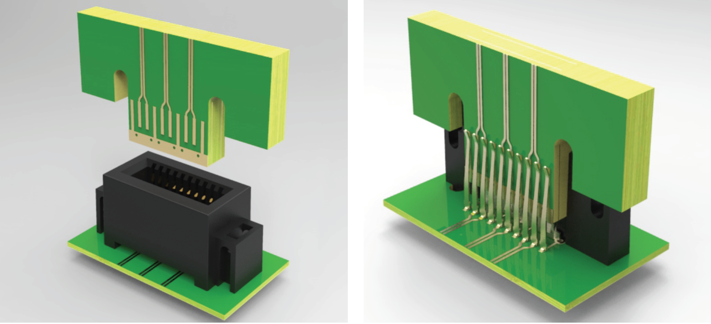

# HALLA U22 
HALLA Ultra 22 All in One

*Read this in other languages: [English](README.md), [Portuguese Brazil](README.pt-br.md)

It is a prototype of a 3D Printer which aims to increase the printing volume without increasing the total size of the printer, bringing other benefits such as:
* Low cost (as possible)
* Simple to assemble
* Better space optimization vs print space
* User defined dimensions (Userd define print volume and script calculate everything else)
* Use of standardized parts
* Closed printer with internal heating
* Rapid interchangeble tools: 3D Printer, Laser, etc
* Automatic Bed leveling
* Reduce noise
* Dual extrusion
* Filament Flow Sensor
* Ultimaker Style 3D Printer: crossed XY printhead linear shaft, closed-loop belt
* XY motors on base to lower center of gravity and reduce shake

Some importante parts that will be used for this project:
* 1 x BTT Octopus Pro v1.1 
* 1 x Raspberry Pi
* 3 x Stepper Motor for Z axis (35x42x42) - 42HSC1404b-200N8
* 1 x Stepper Motor for X axis (50x35x35) - 35HSH7402-24B-400A
* 1 x Stepper Motor for Y axis (50x35x35) - 35HSH7402-24B-400A
* 2 x Pancake Stepper Motor for Extrusion (20x35x25) - G36HSY4405-6D-550
* 2020 and 2040 Alluminium Profile V-Slot

## Interchangeable Tool
The idea behind that is to easily change between tools without change cables. In this way we can quickly change from bowden to direct drive extruder, from single to dual extruder, from 3D Printer to laser engraver or cutter. The limit will reside on the number on eletrical pins available.
To quickly atach or detach the tool will be used 2 Edge Card Connectors with 22 pins each which will provide a total of 44 pins capable to support up to 1000V and 2A.

This type of connection is more resistant than the ones currently used based on pongo and magnet connectors and also cheaper.
The connection between the XY gantry base and the printer will use Flat Flexible cables (FFC) to reduce weight and effort.
The printer will be able to autodetect the tool type based on resistor values at pin 1 and 2, according the table bellow:

| Resistor | Function |
| -------- | -------- |
| 1K | Dual Extruder with bowden drive and BLTouch |
| 2K2 | Dual Extruder with direct drive and BLTouch |
| 3K3 | Single Extruder with bowden drive and BLTouch |
| 4K7 | Single Extruder with direct drive and BLTouch |
| 5K6 | Laser engraver |
| 6K8 | Cutter |
| 7K5 | Foam Cutter |
| 8K2 | Pen holder |
More to come...

| Pin ID | Function | Name | Comment |
| ------ | -------- | ---- | ------- |
| 1 | Tool Name | TN01 | |
| 2 | Tool Name | TN02 | |
| 3 | Heating Tube 1 | H1+ | |
| 4 | Heating Tube 1 | H1+ | used when require more than 2 Amp |
| 5 | Heating Tube 1 | H1- | |
| 6 | Heating Tube 1 | H1- | used when require more than 2 Amp |
| 7 | Heating Tube 2 | H2+ | |
| 8 | Heating Tube 2 | H2+ | used when require more than 2 Amp |
| 9 | Heating Tube 2 | H2- | |
| 10 | Heating Tube 2 | H2- | used when require more than 2 Amp |
| 11 | NTC 1 | T1+ | |
| 12 | NTC 1 | T1- | |
| 13 | NTC 2 | T2+ | |
| 14 | NTC 2 | T2- | |
| 15 |  |  | |
| 16 |  |  | |
| 17 |  |  | |
| 18 |  |  | |
| 19 |  |  | |
| 20 |  |  | |
| 21 |  |  | |
| 22 |  |  | |
| 23 |  |  | |
| 24 |  |  | |
| 25 |  |  | |
| 26 |  |  | |
| 27 |  |  | |

# Features that require work
- [ ] frame setup;
- [ ] printable parts;
- [ ] interchangeable tool;
- [ ] use of fiber carbon tube on xy gantry;
- [ ] script to calculate printer dimmensions based on printable volume;
- [ ] test internal heating based on peltier (while heating the enclosure you can cool the electronics);
- [ ] test Automatic Bed Leveling based on load cell or forse sensitive resistor;
- [ ] use cold air blower based on peltier to cool extruder and printing
- [ ] improve design based on suggestions (version 2.0);